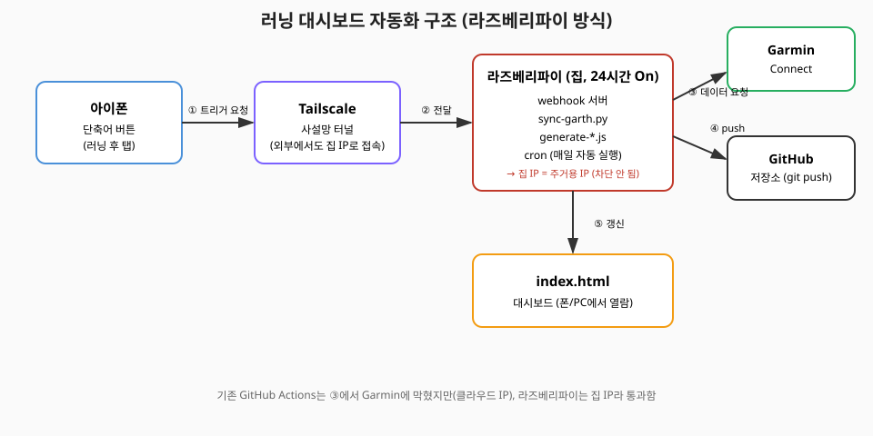
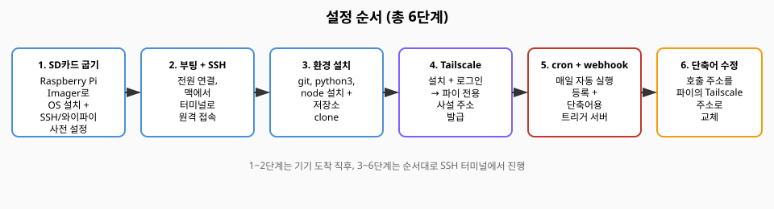

# 라즈베리파이로 완전 자동화하기

GitHub Actions는 클라우드 IP라서 Garmin이 차단(429)합니다. 라즈베리파이를 집에 상시 켜두면
집 IP(주거용)로 요청이 나가서 차단되지 않고, 기존 코드(`sync-garth.py`, `generate-*.js`)를
그대로 재사용할 수 있습니다.



## 준비물
- 라즈베리파이 Zero 2 W(또는 Zero 2 WH) 스타터 키트 — 본체, 케이스, 전원, microSD 카드
- 맥북 (SD카드 굽기 + SSH 접속용, 이후엔 안 써도 됨)
- 집 와이파이



---

## 1. SD카드 굽기

1. 맥에 [Raspberry Pi Imager](https://www.raspberrypi.com/software/) 설치
2. microSD 카드를 맥에 꽂고 Imager 실행
3. **Device**: Raspberry Pi Zero 2 W 선택
4. **OS**: "Raspberry Pi OS Lite (64-bit)" 선택 — 화면 없이 쓰므로 Lite(가벼운 버전)면 충분
5. **Storage**: 꽂은 SD카드 선택
6. 우측 하단 톱니바퀴(⚙️) 클릭 → 아래 항목 설정 후 저장:
   - **Enable SSH** 체크, "Use password authentication" 선택
   - **Set username and password**: 사용자명/비밀번호 기억해두기 (예: `pi` / 본인 비밀번호)
   - **Configure wireless LAN**: 집 와이파이 SSID/비밀번호 입력
   - **Set locale settings**: 타임존은 아무거나 상관없음 (3단계에서 어차피 Asia/Seoul로 다시 맞춤)
7. "굽기(WRITE)" 실행 → 완료되면 SD카드를 파이에 꽂고 전원 연결

## 2. 부팅 + SSH 접속

파이가 와이파이에 붙는 데 1~2분 걸립니다. 맥 터미널에서:

```bash
ssh pi사용자명@raspberrypi.local
```

(안 붙으면 공유기 관리 페이지에서 "raspberrypi"라는 이름의 기기를 찾아 IP로 접속: `ssh 사용자명@192.168.x.x`)

## 3. 환경 설치 + 저장소 clone

SSH로 접속한 상태에서:

```bash
sudo apt update && sudo apt install -y git python3-pip nodejs npm
sudo timedatectl set-timezone Asia/Seoul   # 물리적 위치(시드니)와 무관하게 KST로 고정 — 기존 오전7시/밤10시 로직이 이 기준
pip install garth --break-system-packages

git clone https://github.com/<본인계정>/running-dashboard.git
cd running-dashboard
npm ci
```

기존 맥에서 쓰던 garth 로그인 세션을 옮겨옵니다 (다시 로그인할 필요 없음). 맥 터미널(파이 아님)에서:

```bash
scp -r sessions/garth-yunho sessions/garth-gf pi사용자명@raspberrypi.local:~/running-dashboard/sessions/
```

## 4. Tailscale 설치 (폰에서 즉시 트리거하기 위함)

파이에서:

```bash
curl -fsSL https://tailscale.com/install.sh | sh
sudo tailscale up
```

출력된 로그인 링크를 브라우저에서 열어 본인 계정으로 로그인 → 파이가 tailnet에 연결됩니다.
아이폰에도 App Store에서 **Tailscale 앱** 설치 후 같은 계정으로 로그인하세요.

파이의 tailscale 주소 확인:

```bash
tailscale ip -4
```

`100.x.x.x` 형태의 주소가 나옵니다 — 이게 폰에서 어디서든(와이파이/데이터 상관없이) 파이에 접속할 주소입니다.

## 5. cron 자동 실행 + 트리거 서버

이 폴더의 `pi-sync.sh`, `pi-webhook.js`를 파이의 `running-dashboard/` 안에 복사:

```bash
scp docs/raspberry-pi-setup/pi-sync.sh docs/raspberry-pi-setup/pi-webhook.js \
  pi사용자명@raspberrypi.local:~/running-dashboard/
ssh pi사용자명@raspberrypi.local 'chmod +x ~/running-dashboard/pi-sync.sh'
```

파이에서 cron 등록 (`crontab -e`):

```cron
0 7  * * * cd /home/pi사용자명/running-dashboard && ./pi-sync.sh morning >> sync.log 2>&1
0 22 * * * cd /home/pi사용자명/running-dashboard && ./pi-sync.sh evening >> sync.log 2>&1
@reboot cd /home/pi사용자명/running-dashboard && SYNC_TOKEN=원하는비밀값 node pi-webhook.js >> webhook.log 2>&1 &
```

지금 바로 트리거 서버를 켜려면 (재부팅 안 하고):

```bash
cd ~/running-dashboard
SYNC_TOKEN=원하는비밀값 nohup node pi-webhook.js >> webhook.log 2>&1 &
```

## 6. 아이폰 단축어 수정

기존 단축어가 GitHub API(`workflow_dispatch`)를 호출하던 부분을, 파이를 직접 호출하도록 바꿉니다:

- **URL 가져오기(Get Contents of URL)** 액션의 주소를:
  ```
  http://<4단계에서 확인한 tailscale IP>:8787/?mode=check&token=원하는비밀값
  ```
  로 교체 (Method: GET)
- 기존 GitHub API 인증 헤더 관련 액션은 삭제

이제 러닝 후 단축어를 누르면: 폰 → Tailscale → 집 파이 → Garmin 동기화 → GitHub push → 대시보드 갱신, 전부 자동입니다.

---

**GitHub Actions는 어떻게 하나요?** 굳이 끄지 않아도 됩니다 — 실패해도 그냥 무시되니 그대로 둬도 무해합니다.
다만 헷갈리면 `.github/workflows/sync.yml`의 `schedule:` 트리거만 지우고 `workflow_dispatch`는 남겨서
필요할 때 수동으로도 돌릴 수 있게 해두는 것도 괜찮습니다.
